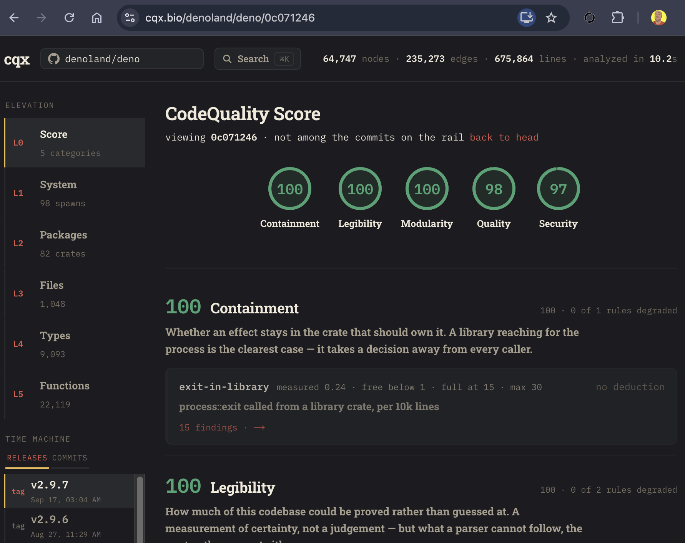
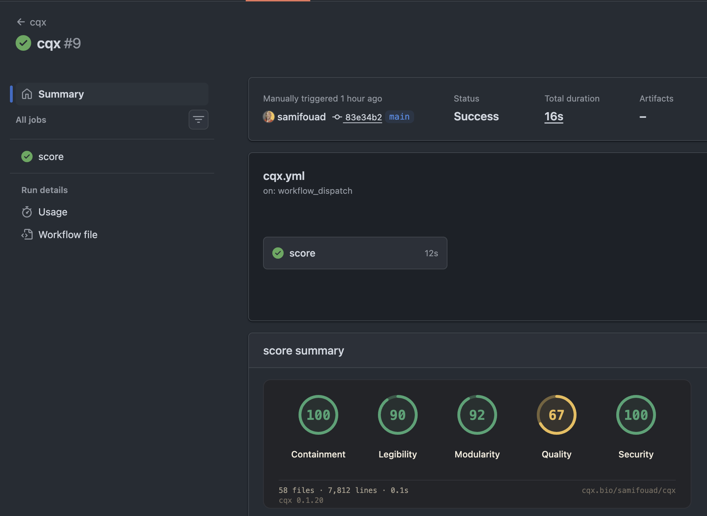
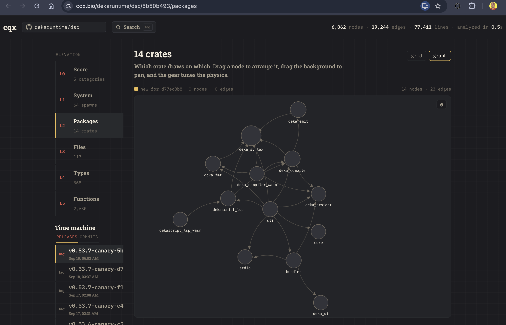

# cqx — CodeQuality Explorer

<p align="left">
  
</p>

See it in your browser: https://cqx.dev/

A queryable graph of a codebase: what it contains, what it touches, and what
crosses its boundaries — and a **CodeQuality Score** derived from it.

<p align="left">
  
</p>

`cqx` has an [official github action](https://github.com/cqxai/action). it is repository-agnostic. It was built while auditing a large Rust workspace
and is calibrated against ripgrep, tokio and deno, but nothing in it is specific
to any project.

`cqx` scans source, emits a language-agnostic stream of facts, loads them into a
graph database, and serves a web explorer over the result.

<p align="left">
  
</p>

It is two halves, and they are deliberately separable:

1. **The index** — scan → facts → queryable graph. Runs in CI, answers questions
   in milliseconds, and can fail a build when a new boundary gets crossed.
2. **The explorer** — a web view over that same graph.

The index is useful with no UI at all. That is on purpose: the UI is how you
explore a codebase, the index is how you defend one.

## Install

```sh
npm install -g @cqxai/cli
cqx --version
```

Or run once with `npx @cqxai/cli --help`. The package is `@cqxai/cli`;
the installed command is still `cqx`.

The npm release includes macOS arm64/x64, Linux x64, and Windows x64.
npm selects the matching `@cqxai/cqx-<platform>-<arch>` optional dependency.

The standalone installer is also available:

```sh
curl -fsSL https://cqx.dev/install | sh
```

## The CodeQuality Score

Every category starts at **100** and is degraded only by a named rule with a
published weight and a cap, so a score is a list of findings rather than a curve
fitted to an imaginary average codebase. No reference population is needed, and
every deduction opens to the file and line that caused it.

The rules target the failure modes of code written fast by many hands — effects
escaping their crate, lints switched off wholesale, the same concept spelled
four ways, bodies copied rather than shared — not abstract elegance.

Thresholds are anchored on real projects rather than intuition, which has already
corrected two wrong assumptions: large files turn out to be normal in Rust
(ripgrep keeps 81% of its lines in files over 500), and raw `unsafe` counts
measure a project's domain rather than its discipline (tokio and deno carry an
order of magnitude more than a CLI does).

## TypeScript and JavaScript

`cqx scan` and the browser WASM API analyze `.ts`, `.tsx`, `.js`, `.jsx`,
`.mjs`, and `.cjs` alongside Rust, producing one score in the original five
categories: quality, containment, legibility, security, and modularity.
The frontend uses [Oxc](https://oxc.rs/docs/learn/architecture/parser), a pure
Rust parser; WASM builds need only Cargo and the Rust target.

TypeScript rule IDs are `typescript/<rule>`. The default rules are
`undocumented-suppressions`, `swallowed-errors`, `dynamic-code`,
`exit-in-library`, `duplicated-bodies`, `oversized-files`, and
`oversized-line-share`. Scope resolution avoids reporting locally shadowed
global APIs. An explained empty catch is allowed; suppressions need a reason
(`@ts-ignore: reason` or `eslint-disable rule -- reason`). Process exits are
allowed in package.json binaries and scripts that directly run `node file.js`,
`tsx file.ts`, or `bun file.ts`; shebang scripts; bin/scripts directories;
`*.config.{js,ts,mjs,cjs}`; and root/src `main` or `cli` files. Literal-only
`Function` constructors stay quiet. A `with` statement obscures global APIs
only inside its body. Calls through aliases are not inferred.

`dynamic-html` and `any-density` are opt-in review rules: sanitized HTML and
interop `any` are often legitimate, and syntax alone cannot establish intent.
They deduct only when enabled in the repository root's real `cqx.json`:

```json
{
  "version": 1,
  "rules": {
    "typescript/dynamic-html": { "enabled": true },
    "typescript/any-density": { "enabled": true },
    "typescript/oversized-files": { "params": { "max_lines": 1500 } }
  },
  "min_score": 70,
  "exclude": ["generated/"]
}
```

Each language uses its own product lines for per-10k-line densities (minimum
500 lines), so adding clean code in another language cannot dilute findings.
Each language gets its own five category scores. For each category, the
headline is the line-weighted average of those scores, rounded to the nearest
integer. The 500-line density floor stays in effect for small languages;
headline weights use their actual product lines. TypeScript thresholds reuse
the Rust ramps, without claiming independent corpus calibration.

Mixed reports add `languages: { <language>: { lines, scores, rules } }`.
Top-level `scores` hold the weighted headline and top-level `rules` retain all
findings and their original deductions. Single-language report JSON stays
byte-identical, with no added block. A numeric `min_score` gates every headline
category. To gate languages independently, use, for example:

```json
{ "version": 1, "min_score": { "rust": 95, "typescript": 85 } }
```

Every category of each named language must meet its floor. A language with no
product lines emits a stderr warning in `scan` and `score`; `--strict` makes
that unevaluable floor fail the command. `--min-score N` overrides either form with a
headline floor. Changing between headline and language floors cannot be proven
to tighten the standard, so `--tighten-only` refuses that change.
Test files (`*.test.*`, `*.spec.*`, test/tests/__tests__ directories) are present
in the graph but excluded from scoring. Files with parser or semantic
diagnostics are skipped; the report names each file and its reason in
`skipped_files`, and scores the remaining files. Declaration files (`*.d.ts`),
minified files (`*.min.js`, `*.min.mjs`), `*.generated.*`, and files with a
leading `// @generated` or bare `/* eslint-disable */` banner are excluded
from scoring. Generated build directories and node_modules are not scanned. TypeScript rules have no environment-variable overrides.
Existing unprefixed Rust config keys remain compatible; `rust/<rule>` is also
accepted in a config file.

## Go

The CLI and WASM API analyze `.go` alongside Rust and TypeScript, with the
same original five categories and a single combined score. `cqx-go` uses
[gosyn 0.2.15](https://github.com/chikaku/gosyn), a maintained pure Rust parser
with generic types/functions, constraints and type arguments. Its production
dependencies have no C build. Build with Cargo and the Rust WASM target alone.

Rule IDs are `go/<rule>`: `exit-in-library`, `shell-invocation`,
`shell-argument-unchecked`, `env-controlled-spawn`, `discarded-check`,
`undocumented-suppressions`, `hand-built-json`, `duplicated-bodies`,
`oversized-files`, and `oversized-line-share`. They reuse the corresponding
Rust category and per-10k-line ramp, with Go's own product-line denominator.
There is no independently calibrated Go corpus yet. Configure only through
repository-root `cqx.json`, using the existing version/rules/min_score/exclude
fields, for example `"go/oversized-files": {"params": {"max_lines": 1500}}`.
Go rules do not accept environment overrides.

`go.mod` supplies module/package identity, including nested modules and reader
shards. `_test.go`, `testdata/`, `vendor/` (including nested vendor directories),
files carrying [Go's standard generated-code header](https://pkg.go.dev/cmd/go#hdr-Generate_Go_files_by_processing_source),
and files with an exclusive tools/ignore build tag remain in the graph but do
not affect scores. Packages named `tool` or `tools`, `cmd/` and `internal/` are
product code. `package main` at any path is an entry point and allows
`log.Fatal`/`os.Exit`; non-main packages under `cmd/` are still libraries.
Import aliases are resolved, lexical shadows
are respected, and unknown signatures are not inferred from names. Discarded
errors are recognized from same-file functions and a narrow set of standard
library APIs; unresolved methods and cross-file functions remain unknown.
Deferred cleanup and ordinary fmt output are allowed; their ignored results
are often intentional and writer contracts cannot be established here. Empty typed error branches are allowed with an
explanation; suppressions use `//nolint:rule // reason`.

Process checks cover `exec.Command` and `CommandContext`: shell command flags
(`-c`, `-lc`, `/C`, `-Command`), non-literal shell scripts, and executable values
traced to `os.Getenv`/`ExpandEnv` through local bindings. Ordinary non-literal
arguments to direct executables are legitimate. These are syntax/provenance
rules, not a Go type checker or whole-program taint analysis. JSON detection
requires an interpolated `fmt.Sprintf` template whose surrounding structure
parses as a JSON object. Duplicate bodies
compare exact token fingerprints (40 tokens minimum), preserving literals.

Parse/tokenization failures skip only the affected file, name it and its
diagnostic in `skipped_files` and the human report, and score the remaining
files without counting skipped lines. A known
gosyn limitation is compact grouped imports lacking a final semicolon or
newline before `)`; gofmt-style imports work. All build-tag variants are read
as source; analysis does not choose a GOOS/GOARCH build or invoke Go tooling.

## Java

The CLI and browser WASM API also analyze `.java`. The strict pure-Rust
Rezel Java SE 26 parser emits facts from its decoded AST; a parse or AST-lowering
failure skips that whole file and reports the reason. No JDK or C compiler is
needed. Classic, instance and compact-source `main` entry classes are recognized;
only the entry method body is exempt; sibling helpers in that class still score.
The parser and its pinned Unicode tables are vendored with unchanged source;
manifest aliases isolate Java Unicode 17 from Rust's existing Unicode 18 tables.
See [the dependency provenance](vendor/README.md).

Rules are `java/exit-in-library`, `java/nonliteral-process`,
`java/swallowed-errors`, `java/undocumented-suppressions`, and the existing
file-size and exact-body-duplication rules. They use the original five categories
and the existing ramps, with Java's product-line denominator. Calibration is
only through `cqx.json`; these defaults have no independent Java calibration.
`System.exit`, `Runtime.getRuntime().exec`, and `ProcessBuilder` are recognized
syntactically. A literal executable with dynamic arguments stays quiet. Local
names and non-standard imports shadow the recognized APIs conservatively.
This is neither Java type checking nor taint analysis; indirect calls, aliases,
and values that become constant through data flow are not resolved. String
parameter density is omitted because this slice does not establish domain types.

Maven/Gradle test layouts (`src/test/`, `src/testFixtures/`, `src/androidTest/`,
`src/integrationTest/`) are excluded
from product scoring. Filename prefixes/suffixes alone do not establish test
code: `TestimonialService.java` and Test-named classes under `src/main` score.
`build/`, `target/`, `generated-sources/`, `generated/` and `vendor/` exclusions
are anchored to the repository root or directories containing `pom.xml`,
`build.gradle(.kts)` or `settings.gradle(.kts)`; Java package directories with
those names still score. Standard `@Generated` annotations and generated
headers are excluded entirely. Empty catches with explanatory comments stay
quiet. Suppressions count only at class scope or when they include `"all"`, and
an adjacent justification comment keeps those quiet too. Specific method,
field and local suppressions such as `"unchecked"` or `"rawtypes"` stay quiet.
Body duplication ignores comments but preserves token and literal values.


## The model

### One graph, not several views

Zoom levels are not separate datasets. They are aggregations over a single node
set joined by a containment spine:

```
system ⊃ binary ⊃ package ⊃ directory ⊃ file ⊃ symbol ⊃ span
```

A package→package arrow is not a primitive fact. It is a rollup of the file and
symbol edges beneath it, so clicking one decomposes into the call sites that
constitute it. Compute an edge twice by two different routes and the levels
disagree; then nobody trusts the picture. So: compute once, aggregate up.

The spatial spine is the **filesystem**, not the module tree. Directories,
files and symbols exist in every language; module systems do not.

### Every edge carries evidence

```
node     := (id, kind, attrs)
edge     := (kind, from_id, to_id, evidence[], confidence)
evidence := (file, line_span, extractor, source: static | runtime, observed_at?)
```

An edge without a file and a line span does not exist. This is what separates a
map from a diagram — every arrow is clickable down to the line that created it,
and an edge nobody can justify is a bug in an extractor rather than a lie in
the UI.

### Edge kinds

Structural edges are numerous and boring. Effect edges are few and dangerous.
The default view shows effects; structure is a layer you turn on.

| kind | meaning |
|---|---|
| `contains` | the zoom spine |
| `depends_on` | package → package |
| `imports` | file → symbol |
| `calls` | symbol → symbol |
| `spawns` | symbol → external process |
| `reads_env` | symbol → environment variable |
| `crosses` | a declared boundary (language edge, client/server split, host call) |
| `effect_fs` / `effect_net` / `effect_exec` | symbol → capability |

Only `contains` and `depends_on` are required. An extractor emits what it can
prove and says so; missing edge kinds degrade the view, they never corrupt it.

### Stable IDs

Identifiers are path-addressed, never line-addressed:

```
pkg:grep_searcher
file:crates/searcher/src/sink.rs
sym:grep_searcher::sink::matched
```

Three properties follow, and none of them are available otherwise:

- **Annotations survive refactors.** Notes and generated summaries attach to a
  symbol, not to line 74.
- **Two graphs can be diffed.** Main versus a branch.
- **The diff is the detection.** You do not have to enumerate every bad pattern
  in advance: a *new edge kind appearing where none existed* is itself a signal.

### One temporal graph, not one graph per commit

Edges carry validity in commit space (`first_seen`, `last_seen`). The graph at
any commit is a filter; "when did this edge appear" is a field read rather than
a bisect. With stable IDs the commit-to-commit delta is small, so CI appends
rather than snapshots.

## Extractor contract

The core knows nothing about any language, and there are two ways in.

**Bundled extractors are crates.** Each one owns a command and registers it with
the CLI registry from `deka-cli-core`; the `cqx` binary is composition only, so a
handler can exist nowhere but its owning crate (the rfd#61 pattern, which exists
precisely because implementations kept leaking into the core crate).

```rust
// crates/cqx-rust/src/lib.rs — the handler body lives with the language
pub fn register(registry: &mut Registry) {
    registry.add_command(EXTRACT_COMMAND);
    registry.add_flag(FlagSpec { name: "--quiet", .. });
}
```

```rust
// crates/cqx/src/main.rs — the binary's whole job
RegistryBuilder::new().with(cqx_rust::register)
```

**Out-of-tree extractors are programs.** Anything that writes the same facts to
stdout participates without being in this repo:

```
cqx-extract-<lang> <path>  >  facts.ndjson
```

Either way the schema is identical. Language-specific vocabulary lives in a
`lang:` attribute namespace, never in core node or edge kinds.

## Non-goals

- Inferring architecture from code. Declared intent is checked against observed
  facts; what the tool infers on its own, it does not enforce.
- Being a linter. Existing tools are better at single-file rules. `cqx` is for
  relationships between things.
- A pretty dependency hairball. If the default view needs a legend, it failed.

## Layout

```
crates/
  cqx/             the binary — registry + dispatch, no handler bodies
  cqx-schema/      fact schema + stable ids (the contract everything else depends on)
  cqx-rust/        Rust extractor: owns the `extract` command
fixtures/basic/     a workspace with deliberately planted facts
```

The web explorer lives in [deka explorer](https://github.com/dekaruntime/explorer), so
this repository stays Rust. `deka explore` in the deka toolchain is a downstream
consumer of cqx, not a part of it.

## Configuring the rules

Defaults are calibrated against ripgrep, tokio and deno. Override any of them in
a `cqx.json`, searched for upward from the scanned path:

```json
{
  "version": 1,
  "min_score": 70,
  "rules": {
    "exit-in-library": { "weight": 10 },
    "duplicated-bodies": { "enabled": false }
  }
}
```

A file need only mention the rules it changes. Every field can also be set from
the environment, which is how CI usually wants to do it:

```
CQX_RULE_EXIT_IN_LIBRARY_WEIGHT=10
CQX_MIN_SCORE=70
CQX_CONFIG=/path/to/cqx.json
```

Precedence is defaults, then file, then environment, then flags.
`cqx score --explain` prints every rule with its thresholds and where each one
came from. `--min-score` exits non-zero when any category falls below it, which
is the CI gate.

## Try it

```
cargo run -p cqx -- extract fixtures/basic
cargo run -p cqx -- extract /path/to/a/workspace --out facts.ndjson
```

`fixtures/basic` exists so output can be checked against a known answer instead of
eyeballed: a planted process spawn, two env reads, an unsafe block, a `static
mut`, filesystem and network effects, and a library that calls `process::exit`.

## Asking cqx from an agent

Point the agent at the local command. For Claude Code:

```
claude mcp add cqx -- cqx mcp
```

Nothing leaves the machine. Four of the five tools are read-only — `score`,
`findings`, `rules`, `explain`.

The fifth is `propose_rule`, and it is the point. An agent may make a rule
**stricter** and may not make it looser:

```
propose_rule oversized-files.weight 40
  because "we split files at review anyway"
→ written, 25 → 40, tighter

propose_rule oversized-files.free 9
→ Refused: this would lower the standard, and only a person may do that.
```

Without that asymmetry, "make the score go up" has two solutions — write
better code, or lower the bar — and the second is faster, always available,
and looks identical in a diff to anybody skimming. It is also why letting an
agent do this is safe rather than merely guarded: tightening a rule makes the
number it is measured by harder to reach, so it is never in its short-term
interest. What it is good for is the thing a reviewer does by hand today —
noticing that a standard should be higher, and saying so once instead of
correcting the same thing every week.

`because` is required, and is kept in `cqx.json` beside the rule. A threshold
somebody finds in a year with no explanation is a threshold nobody dares
change.

A person may go either way:

```
cqx config set oversized-files.free 9        # allowed, and it says "looser"
cqx config set oversized-files.free 9 --tighten-only   # refused
```

## Scoring a history

```
cqx history /path/to/repo --commits 20
```

Materialises each commit with `git archive` — the working tree is never touched,
so this is safe against a repository somebody is using — extracts, scores, and
writes `history.json` with a per-category score and the change against the
previous commit.

A commit's score can never change, so each one is written once and reread
thereafter: twelve commits of a 75k-line workspace take 15 seconds cold and half
a second warm.

## Recalibrating

Nothing here is a fact about good code; some of it is a house standard. File
length is the clearest case — measured across ripgrep, tokio, deno, deka and dsc,
it tracks a project's habits rather than its quality, and the best-regarded
codebase in that set has the *most* large files. So cqx ships a lenient default
and makes the knob obvious.

```
cqx config show                                  # or --json, for a reader that is not a person
cqx config set oversized-files.max_lines 2500
cqx config set oversized-line-share.enabled false
```

`config set` rewrites one field and leaves the rest of the file alone, checks the
rule and field exist, and names the accepted fields when one does not. The
effective configuration travels with every result — `score --json` and
`history.json` both carry it — so anything rendering those shows the standards
they were scored against rather than cqx's defaults.

## Conformance

cqx reads a workspace by parsing manifests rather than by running
`cargo metadata`, so cargo is the oracle: whatever it reports about packages,
versions and target roots is what the parser has to reproduce.

`reference-repos.toml` pins ripgrep, tokio and deno by commit, and CI fetches
them to check the parser against all three. They are here because our own
repositories were not enough — three cargo rules were found only when an
external project disagreed:

- a build script at a repository root would otherwise claim the whole repository
- declared `[[example]]` targets do not replace discovery, they add to it
- a path in `[workspace.dependencies]` makes a member even when nothing draws on it

Locally the test skips when the checkouts are absent. Setting
`CQX_REFERENCE_DIR` asserts they are present, so a failed fetch fails the job
rather than quietly checking nothing.


## Shared project layout

`cqx-layout` is the single policy for snapshot discovery and all frontends.
Repository roots and directories holding pom.xml, build/settings.gradle(.kts),
Package.swift, build.zig, pyproject.toml/setup.py/setup.cfg, composer.json,
package.json, go.mod, Cargo.toml or *.csproj anchor ecosystem build/vendor/output
exclusions. A product package named build/target/env/cache/generated/test remains
source. A virtualenv is identified by pyvenv.cfg, independently of its name;
Python root outputs include dist, .tox, node_modules, __pycache__ and *.egg-info.
Roots and virtualenv markers travel with coordinator metadata to every reader.

Generated headers use exact ecosystem markers: Go/protoc `Code generated … DO NOT
EDIT.`, `// @generated` (or the ecosystem's comment spelling), parsed Java/Kotlin
`@Generated` annotations, and `<auto-generated>` for applicable ecosystems.
Ordinary comments containing "generated by" or "do not edit" are source.
Go's marker must be a standalone line comment at column zero before package.

Tests follow root-relative layouts: Java/Kotlin src/test and named test source
sets, SwiftPM Tests, pytest tests plus test_*.py/*_test.py/conftest.py, PHPUnit tests
plus *Test.php, Zig embedded test declarations plus *_test.zig. Imports, prefixes
and arbitrary segments named test/tests do not turn product files into tests.
Kotlin *Test.kt/*Tests.kt outside test source sets remain product code, including
libraries that ship reusable testing support. Rust's manifest targets and existing
TypeScript/Go entry/binding semantics are retained; their fixture reports are
unchanged. TypeScript/Go now share anchored exclusions and source roles.

Entry exemptions use parsed declaration/block ranges. Main methods/functions,
Swift @main types' main methods, script top-level bodies, positive Python __main__
guards and declared console functions cannot exempt sibling/nested helpers.
Specific member/line suppression codes are quiet: Java unchecked, Kotlin
UNCHECKED_CAST, noqa: E501, type: ignore[attr-defined] and phpcs:ignore Sniff.Name.
Broad `all`, class-level blanket annotations and code-less directives still count
unless explained. No new weights or scoring categories are introduced.

## Kotlin frontend

Kotlin 2.4 .kt/.kts files use the strict pure-Rust Rezel parser and private Unicode
17 tables. Rules cover bound exitProcess, Runtime.exec, empty catches, broad
Suppress annotations and the existing size/body-duplication ramps. Entry detection
recognizes top-level main and @JvmStatic main signatures. Parsed .kts top-level
initializers are script entries, while helper functions still score. The current
parser accepts declarations/initializers but rejects many statement-based Gradle
scripts and some multiline infix expressions; these are whole-file skips with
visible diagnostics. No Kotlin/JVM toolchain or type/taint analysis is required.

## Swift frontend

Swift 6.3 files use the maintained pure-Rust Rezel parser in CLI and WASM.
Whole-file syntax errors are reported as skips. Library exit/fatalError, locally
constructed Foundation.Process launch paths, empty catches and try!/expression
force unwraps contribute to the original five categories. Body duplication and
file size/share reuse the existing rules. Configure only `swift/<rule>` in
`cqx.json`; these are syntax/binding findings, not whole-program type or taint
analysis. Force-unwrap/try! density excludes Package.swift, main.swift top-level
script expressions and test targets; helpers declared in main.swift still score.
Literal executables with dynamic arguments stay quiet. main.swift,
@main types' main methods and top-level script bodies are scoped entries; tests and generated,
.build, Pods, DerivedData and Carthage sources do not score as product code.
The parser is vendored unchanged with private Unicode tables (see vendor/README.md),
so existing Rust identifiers retain their Unicode version. No extra WASM toolchain.


## Zig frontend

Zig files use the pure-Rust zigsyn 0.1.0 structured parser in CLI and WASM.
Parse failures skip/report whole files. Bound std.process.exit, catch unreachable
and unexplained catch {}, and non-literal std.process.Child.init executable
arguments contribute syntax evidence in the original five categories. Exact body
duplication and file size/share reuse the existing rules. These findings do not
claim whole-program types or taint analysis. Only cqx.json calibrates zig/<rule>.
Public root `main` and the `build` function of build.zig are scoped entries.
Embedded `test` blocks and `*_test.zig` files do not contribute product lines; zig-cache, .zig-cache, zig-out
and generated/vendor sources are excluded. Literal argv executables with dynamic
ordinary arguments stay quiet. `catch unreachable` is quiet in tests, explicit
comptime contexts, and direct calls to uniquely named local functions whose
return type is explicitly `error{}!T`. Inferred, external, nonempty and unknown
error sets still fire. This bounded proof does not execute Zig or infer types.
No extra WASM toolchain is required.


## Python frontend: scope of the score

Python 3.14 files are parsed by pure-Rust Rezel in CLI and WASM. The score
measures source effects and containment (bound sys.exit/os._exit), security
review sites (dynamic shell commands, builtin eval/exec, pickle and yaml.load
without a bound SafeLoader), broad error discards, unexplained noqa/type: ignore,
exact body duplication and oversized files. It uses only the original five
categories and python/<rule> settings in cqx.json. It does **not** measure
unannotated static types, type safety, string-parameter domains, runtime values
or taint flow; no type-level rule is ported merely because Python accepts hints.
A high score is not a guarantee about those unmeasured properties.

Imports/aliases and Python's NFKC identifier normalization bind standard APIs;
custom/shadowed functions stay quiet. Literal commands, shell=False argv, explicit
SafeLoader/CSafeLoader, handled or explained catches and suppression reasons stay
quiet. Literal eval/exec arguments stay quiet. `pickle.loads` fires only for
a non-literal/non-constant argument: this is an externally variable payload
review signal, not a claim of taint. Constants mean a uniquely assigned uppercase
module name initialized by a literal; dynamic values/reassignments remain findings.
`pickle.load` still reports stream deserialization. __main__.py/setup.py top-level
bodies, declared console/gui functions from nested pyproject.toml/setup.cfg/setup.py,
and positive __name__ guard blocks are scoped entries; helper functions still score. Entry metadata travels to sharded readers. Dynamic setup
metadata is not executed or guessed. Venvs, site-packages, caches, generated/vendor
sources and tests are excluded from product scores. Parse failures skip/report
whole files. See vendor/README.md for unchanged parser/private Unicode provenance.
No extra WASM toolchain is required.


## PHP frontend: scope of the score

Pure-Rust Rezel PHP 8.5 parsing feeds CLI and WASM scans. The score measures
source effects, containment, visible security review sites and structural quality:
library exit/die, non-literal shell/process commands and interpolated backticks,
eval, parameter/superglobal-looking unserialize without allowed_classes=false,
SQL concatenation at bound PDO/mysqli query APIs, empty catches, @ suppression
density, unexplained phpcs/phpstan suppression, exact duplication and file size.
It uses the original five categories and only php/<rule> in cqx.json.

Optional parameter/return declarations and strict_types are retained as facts.
Declarations bind PDO/mysqli and distinguish numeric SQL terms/string legacy
assert input. The score does **not** measure complete type safety, untyped values,
taint flow, framework semantics or general correctness; no string-domain rule
is invented for PHP scalar APIs. A high score makes no promise about those gaps.
String assert and create_function are legacy execution APIs: they are scored only
when the nearest Composer PHP requirement demonstrably admits pre-8.0 versions
(using recognized semver clauses). Missing/unsupported requirements do not infer
legacy execution; modern string assert is not counted as dynamic code.

Composer bin scripts (including nested manifests and extensionless PHP files),
root index.php and public/web front controllers are entry units. Metadata travels
to sharded readers. Only entry script bodies are exempt, not functions/classes
in those scripts. PHPUnit `tests/` layouts and `*Test.php` names, vendor and generated files
do not score as product sources. Whole-file parse failures skip/report. Literal
executables/argv, escaped dollar backticks, class-free unserialize, numeric casts
and typed numeric/PDO-quoted SQL, handled/explained catches and suppression reasons
stay quiet. No extra WASM toolchain is required.

## Modular browser/Worker host

`scripts/cqx-loader.mjs` exposes `createLoader({manifest, manifestSha256, baseURL, fetchBytes?,
compiledModules?, onProgress?})`. Keep one loader per immutable release manifest;
its compiled-module cache is keyed by version, ABI and SHA-256. Every scan gets
fresh instances. `await loader.scan(files, {repo, label?, config?})` accepts an
iterable of `[snapshotRelativePath, source]` and returns `{dataset, reportJson}`. The dataset has one
`score` report; `reportJson` retains the exact Rust JSON report bytes (including
floating-point spelling). Empty config uses the root `cqx.json`. Module facts enter the
core engine before scoring; language scores are never combined.

```js
import { createLoader, verifyManifest } from './scripts/cqx-loader.mjs';
const baseURL = 'https://your-versioned-wasm-host/v0.1.24/';
const releaseURL = 'https://github.com/cqxai/cqx/releases/download/v0.1.24/';
// Check response.ok for both requests in your host's fetch/error adapter.
const checksums = await (await fetch(new URL('SHA256SUMS', releaseURL))).text();
const bytes = new Uint8Array(await (await fetch(new URL('manifest.json', baseURL))).arrayBuffer());
const trusted = await verifyManifest(bytes, checksums);
const loader = createLoader({ ...trusted, baseURL });
const {dataset, reportJson} = await loader.scan([['src/lib.ts', 'export function f() {}']], {
  repo: 'org/repo',
});
```

The trust anchor is the immutable GitHub release's `SHA256SUMS`, retrieved over
HTTPS independently of the WASM CDN, or its manifest SHA-256 pinned in the host's
build. Do not obtain the pin from the module origin. `verifyManifest` verifies raw
manifest bytes; the loader also checks the generated manifest serialization against
that pin before any scan or module fetch. A CDN replacement of both the manifest
and module therefore fails. This trusts the GitHub release publisher and HTTPS;
it is integrity verification, not a signature or protection from a compromised
release account. Hosts whose browsers cannot fetch GitHub assets directly should
embed the checksum at build/deploy time (Workers do the same).

Browser/Node hosts verify downloaded bytes before compilation. Workers that
cannot compile bytes at runtime pass trusted deployment bindings as
`compiledModules: {core: {module: CORE_BINDING, sha256: manifest.modules.core.sha256}}`
(and `c`/`csharp` bindings when deployed). The deployment must verify the binding
bytes against the manifest; runtime checks still enforce binary identity/version/
ABI. Missing required modules, hashes, incompatible binaries, network failures,
compilation/instantiation and extraction failures reject the scan with a named
module error. Callers must show that error and must not present partial scores.

Routing is by extension using the shared `scripts/wasm-catalog.mjs` contract.
Core contains the engine and all pure-Rust frontends; C/C++ and C# are separate
heavy modules. Metadata is coordinated before routing; only each module's source
text is sent to its reader. Core also handles extensionless Composer binaries.
Build all three modules and the monolithic parity reference with
`python3 scripts/build-wasm-modules.py`. The resulting `.target/wasm-dist/manifest.json`
is generated from the actual binaries, including their version/ABI identities and
SHA-256 hashes. `node scripts/test-modules.mjs .target/wasm-dist` exercises the
complete split pipeline against the monolith.

## Pinned grammar build dependency

Zig **0.15.2** is a deliberate pinned build dependency for tree-sitter's C grammar
sources. It includes its own compiler; a separate system LLVM installation is
never required. Native Rust linking still uses the host's ordinary linker/SDK.
Python 3.12+ bootstraps checksum-verified official archives into `.target/zig`;
`scripts/zig-toolchain.json` records the version and SHA-256 for Intel/ARM macOS,
Linux and Windows. The pin comes from https://ziglang.org/download/index.json.
The cc-rs adapter translates `--target=wasm32-unknown-unknown` to Zig's
`--target=wasm32-freestanding`; tree-sitter's pinned freestanding headers supply
the existing libc shim. Build-tool environment variables never configure scans.

```sh
python3 scripts/build-tree-wasm.py
node scripts/wasm-manifest.mjs .target/wasm-dist core
node scripts/test-loader.mjs .target/wasm-dist
```

Use `--cache PATH` to choose a build cache and `--output PATH` for a copied wasm
artifact. Cached archives are verified on every use; corrupt caches fail closed.
Unsupported hosts produce an explicit missing-pin error.

## C/C++ and C# scope

C/C++ uses tree-sitter C 0.24.1 and C++ 0.23.4; C# uses the WillBooster C# grammar
2.0.2 with tree-sitter runtime 0.27.0 / language 0.1.8. These grammar pins retain
the freestanding shim rather than modifying or vendoring grammar sources.
Frontends use `cqx-layout` for project-root exclusions, test roles, generated
headers, declaration-scoped entries and specific suppression codes. Main/entry
bodies are exempt from library termination; sibling and nested helpers are not.
C test preprocessor blocks and C# test attributes retain their existing scopes.

These are syntax rules, without preprocessing, cross-translation-unit types,
cross-file C# name binding or taint inference. Macro/conditional fragments can
cause a whole-file parse skip, which remains visible in the report. Specific
NOLINT/diagnostic/CS warning codes stay quiet; broad unexplained suppression
still fires. Calibration remains in `cqx.json`, using the existing ramps.

Pinned corpus evidence and full-report hashes are in `docs/heavy-language-evidence.json`.
Scores below are containment / legibility / modularity / quality / security.
Each headline weights independent language scores by actual product lines.

| Repository | Scores | Coverage parsed/skipped |
| --- | --- | --- |
| Redis | 98/100/100/100/100 | C 143/50, C++ 82/5 |
| double-conversion | 100/100/100/94/100 | C++ 35/5 |
| Humanizer | 100/100/100/90/100 | C# 728/7 |

Split and monolithic reports have identical complete JSON bytes on all three
pinned corpora, all language fixtures and the Rust/TS/Go/C/C++/C# fixture;
complete datasets also agree. Existing main goldens and the C# golden are
unchanged. The corpus evidence records all frontend coverage and full hashes.
C/C++ `out`, `external`, and `deps` exclusions are relative to the project root
or a recognized build-system marker; source such as `src/external/` is scored.

Directory discovery retains sibling sources under C/C#-specific names such as
`deps/` and `bin/`; the owning frontend applies its exclusion. Adding a language
must not remove another language's input before dispatch. Actual directory CLI
scans reproduce the score tuples above.

## WASM release artifacts and single-file transition

The existing tag-triggered `release.yml` publishes `core.wasm`, `c.wasm`,
`csharp.wasm`, `manifest.json`, `cqx-loader.mjs` and `wasm-catalog.mjs` as GitHub
release assets and into the existing `cqx-wasm/<tag>/` R2 bucket paths, with WASM,
JSON and JavaScript content types. The manifest records each module's version,
ABI, languages, extensions and SHA-256. Publication uses the same existing
release environment; dispatch remains build-only.

The **first modular release** also publishes the complete monolith under the old
`cqx_wasm.wasm` name, with a `deprecated_artifacts` manifest entry and
`WASM-DEPRECATION.md`. The next release omits it. `scripts/wasm-compat.mjs` inspects
the previous GitHub release's actual asset inventory, rather than guessing a
version number; reruns of the transitional release retain its manifest policy.
A failed inventory read fails the build. Historical versioned assets stay at
their existing URLs. Hosts should adopt the loader before the next release.

`scripts/package-wasm.mjs` validates the complete module set, source version,
ABI/identity and actual hashes before assembling an empty upload directory. This
prevents mixed or stale cached artifacts from becoming a partial release.

```sh
node scripts/package-wasm.mjs .target/wasm-dist .target/wasm-upload --legacy
node scripts/test-wasm-package.mjs .target/wasm-dist
python3 scripts/prove-wasm-package.py .target/wasm-dist
```

The first command only assembles local files; release promotion remains the
existing tag/release workflow. Omit `--legacy` to assemble later selective releases.
